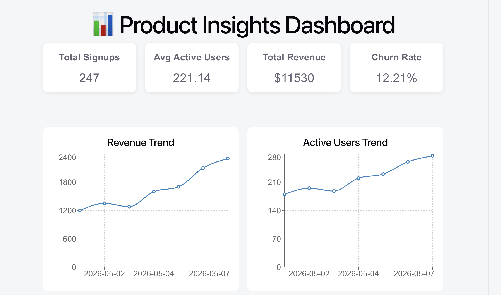
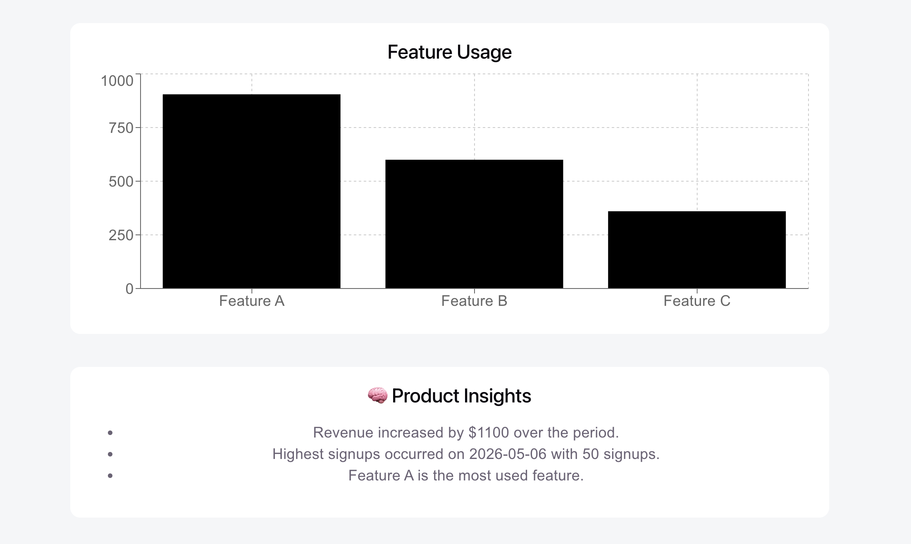

# Product Insights Dashboard 📊

## 📌 Overview

Product Insights Dashboard is a full-stack analytics application built using:

- React
- FastAPI
- Pandas
- Recharts
- CSV-based analytics

The project simulates a real-world product analytics dashboard used by product managers and engineering teams to monitor business metrics and user engagement.

---

## ✨ Features

### 📈 Analytics Dashboard
- KPI summary cards
- Revenue trend analysis
- Active users trend
- Feature usage analytics

### 🧠 Product Insights
- Automated insight generation
- Churn tracking
- Signup analysis
- Feature adoption insights

### ⚙️ Backend APIs
- FastAPI REST endpoints
- CSV data ingestion
- Business metrics calculations
- JSON analytics responses

### 🎨 Frontend
- Responsive dashboard UI
- Interactive charts with Recharts
- KPI cards
- Insights panel

---

## 🛠️ Tech Stack

### Frontend
- React
- Vite
- Recharts
- CSS

### Backend
- FastAPI
- Python
- Pandas

### Data
- CSV analytics dataset

### Tools
- Git
- GitHub

---

## 📂 Project Structure

```text
product-insights-dashboard/
│
├── backend/
│   ├── main.py
│   ├── requirements.txt
│
├── frontend/
│   ├── src/
│   ├── package.json
│
├── data/
│   ├── product_metrics.csv
│
└── README.md

## 📸 Screenshots

### Dashboard


### Features


---

## 👨‍💻 Author

**Aneesh Neladri**

- GitHub: https://github.com/aneladri